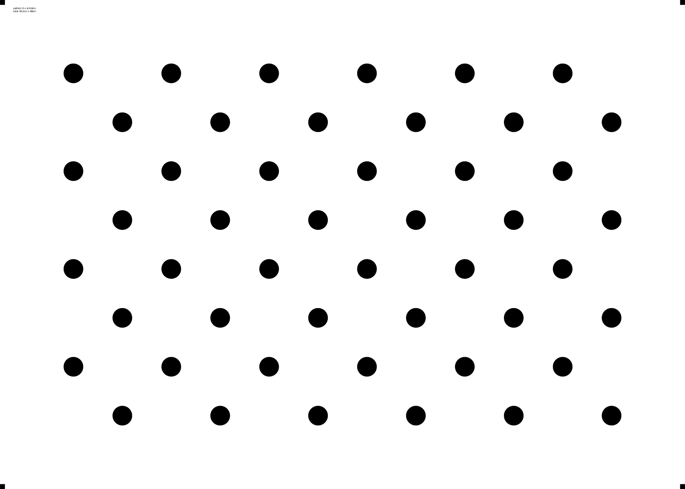
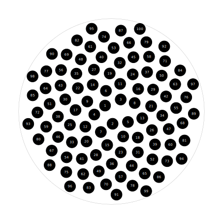

# tikz-calibration-patterns
Generate various patterns for camera calibration purposes using Latex/TikZ. Board dimensions, colors and meta info are customizable.

Each pattern is a standalone `.tex` file. All patterns can be found in [patterns/](./patterns) folder. To adjust pattern parameters, open the corresponding `.tex` file and look for options at the top of the file. 

Finally, create a `.pdf`
```
pdflatex patterns/<pattername>.tex
```
In case you do not have LaTeX installed, you might want to try [Overleaf](https://www.overleaf.com/) to compile.

## Available patterns

### Chessboard `patterns/chessboard.tex`


### Circles `patterns/circlepattern.tex`


### Sunflower `patterns/sunflowerpattern.tex`

