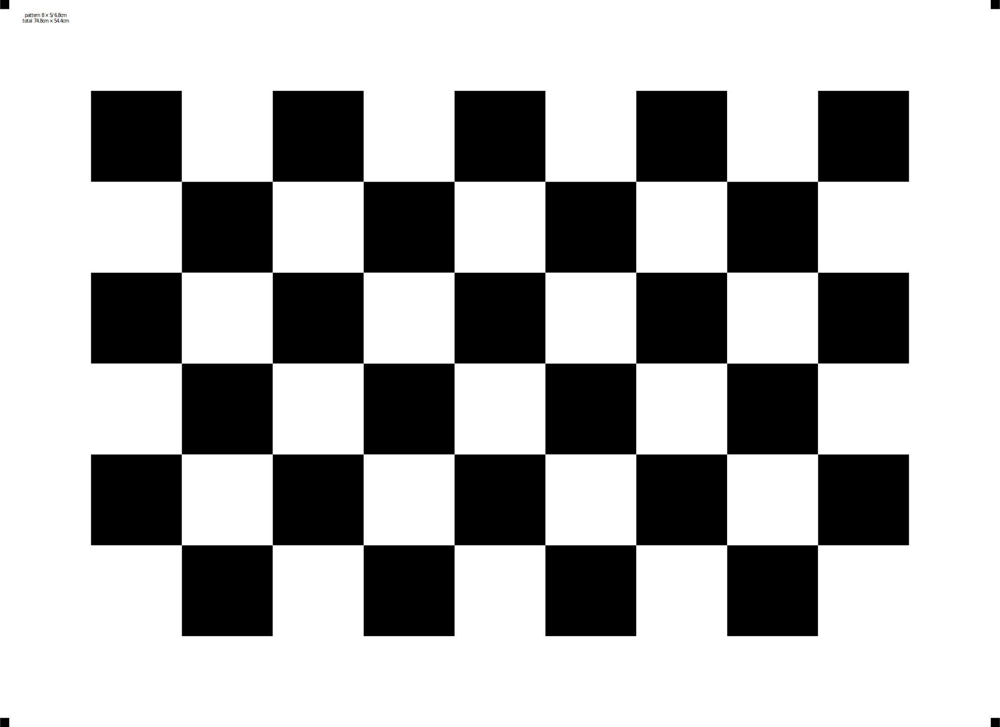

# tikz-calibration-patterns
Generate various patterns for camera calibration purposes using Latex/TikZ. Board dimensions, colors and meta info are customizable.

Also available as an Overleaf template (link added shortly).
